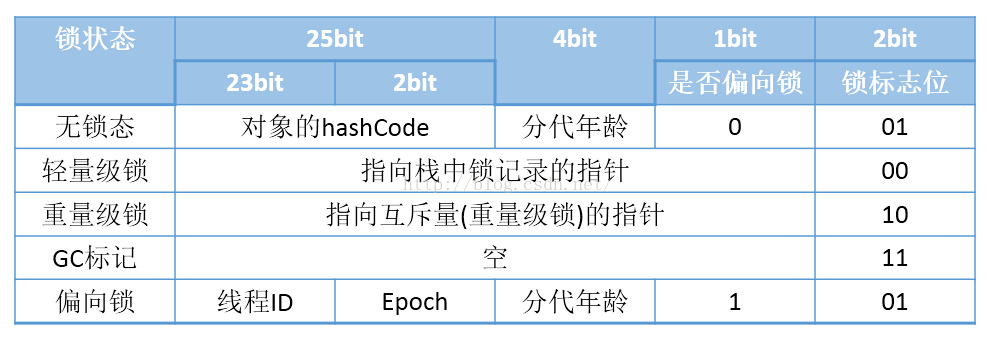

### [JVM]()

#### 运行时数据区

+ JVM 执行过程中，会将其管理的内存划分为若干数据区域。这些区域各司其职，拥有各自的创建和销毁时间！

  

##### 程序计数器

+ 程序计数器是线程私有的一小块内存，生命周期与线程相同！

  表示**当前线程所执行的 字节码的 行号指示器！**

  **字节码解释器 通过改变 程序计数器 来选下一条需要执行的字节码指令！**

  程序的分支、循环、跳转、异常处理、线程恢复等都依赖 程序计数器 完成！

+ 为什么 线程私有？

  由于一个确定的时刻，一个处理器（1个核）只会处理一条线程中的指令，所以，jvm 的多线程是通过 CPU为每个线程分配 时间片，线程根据时间片轮转执行 实现的！

  **为了线程切换后能恢复到正确的位置，每条线程都需要有一个独立的程序计数器，各条线程之间互不影响，独立存储！**

+ 状态

  1. 如果正在执行的是 Java 方法，则计数器值为 正在执行的 虚拟机字节码指令 的地址！
  2. 如果正在执行的是 Native 方法，则计数器值  为 空（Undefined）！

+ 程序计数器是 内存区域中 唯一一个 没有规定 OOM 情况 的区域！

##### Java 虚拟机栈

###### 介绍

+ java 虚拟机栈是线程私有的内存区域，生命周期与线程相同！

+ java 虚拟机栈 描述的是 **java 方法执行的线程内存模型**：

  每个方法给执行时，jvm 都会为其创建一个 栈帧，用于存储 *本地变量表、操作数栈、动态连接、方法出口*等信息！

  每个*方法从被调用到执行完毕，就对应着一个栈帧 在虚拟机栈中从入栈到出栈的过程！*

+ 异常：

  OutOfMemory：栈进行动态扩展时，无法申请到足够的内存！（栈帧过多？）

  StackOverFlow：线程申请的栈深度大于虚拟机所允许的深度！（操作数栈的深度？）

  ```
  HotSpot 特殊一点？ P44 注释
  ```

  ****

###### 局部变量表

+ java 虚拟机会使用 局部变量表 **完成形参到实参的传递**！

+ 如果方法是 实例方法（无 static 修饰），则局部变量表的 0 号槽默认为隐式参数 this（对象本身）。

+ 局部变量表大小在类加载阶段就被确定！

  [详见补充内容：Class文件 方法表]()

###### 操作数栈

+ 执行过程：

  + 方法未执行时，栈为空；方法执行过程就对应着 方法的字节码指令 在操作数栈中 入栈和出栈的过程！

  + 方法执行时，字节码指令会从局部变量表中获取 变量 压入栈中，当需要做运算/数据处理时，从栈中弹出数据，处理完之后，将结果保存到局部变量表 或者 继续将结果压栈！

+ 栈深度在 类加载阶段就被确定！

  [详见补充内容：Class文件 方法表]()

+ 在概念模型中，两个栈帧时完全独立的，然而，实际当方法中调用其他方法时，两个栈帧会出现一部分重叠，使得两个方法能够共享一部分数据，而无需额外的参数复制与传递，节约了部分空间！

  

###### 动态连接

+ 每个栈帧都包含一个指向 运行时常量池 中该栈帧所属方法的引用，这是为了支持方法调用过程中的动态连接！

  ```java
  /*
   · Class 文件的常量池中存放有大量的符号引用，字节码中的方法调用指令就以常量池里指向方法的符号引用作为参数！
   	这些符号引用一部分会在类加载阶段或者第一次使用时就被转换为直接引用，这称为静态解析；
   	而另外部分将在每一次运行期间都转化为直接应用，这部分称为动态连接！
   
   · <详见补充内容：Class文件 常量池>
  */
  ```

  [详见补充内容：Class文件 常量池]()

##### 本地方法栈

+ 本地方法栈 与 java虚拟机栈 发挥的作用类似，区别在于：
  + Java 虚拟机栈 是为 虚拟机执行 **java方法（也就是字节码）服务**
  + 本地方法栈：为虚拟机使用到的 **本地方法（Native）服务**
+ HotSpot 虚拟机将两者合二为一。
+ 与虚拟机栈一样，《JVM 规范》规定：本地方法栈
  + 栈深度溢出时 ：抛出 StackOverFlow 异常！
  + 栈扩展失败时 ：抛出 OutOfMemory 异常！

##### Java 堆

+ 堆 是 JVM 管理的内存中最大的内存区域，用于存放对象实例，java 中**几乎所有的对象实例都在堆上分配内存**！

  因此，java 堆是线程共享的！

+ java **堆是垃圾回收器管理的内存区域！**

+ 为更好的回收内存、更快地分配内存，*HotSpot 采用分代收集理论 管理Java堆 ，Java堆被细分为 新生代、老年代！*

  新生代：又被细分为 Eden、From Survivor、To survivor 三块区域，用于存放 小对象、新对象！

  老年代：用于存放 大对象、老对象！

+ 可通过参数 **-Xmx 和 -Xms** 设定堆大小

  如果 java 堆 不能为新对象分配内存，并且堆无法再扩展时，JVM 将会抛出 OOM 异常！

##### 方法区

+ 方法区是线程共享的内存区域。用于存放被 java 虚拟机加载的 *类型信息*、*常量*、*静态变量*、*即时编译器编译后的代码缓存* 等数据。

+ 《 Java虚拟机规范 》中规定，当 方法区无法满足新的 内存需求时，将会抛出 OOM 异常！

+ **运行时常量池**

  + **class 文件常量池** 在 编译期生成，用于存放类相关的 *字面量和符号应用* ；

    而在类加载之后，*类相关的字面量、符号引用 以及 由部分符号引用翻译出的直接引用* 将会被加载到 运行时常量池中！

  + 运行时常量池 vs class文件常量池

    *运行常量池具备动态性* ：java 语言并不要求只能在编译期生成常量，即，并非预置入 Class 文件常量池 的内容才能进入 运行时常量池，运行期生成的常量 也能 存储在运行时常量池中！

    例如：String 类的 intern() 方法！

  + **运行时常量池** 是 方法区的一部分，受到方法区内存的限制，当常量池无法再申请到足够的内存时会抛出 OOM 异常！

+ HotSpot 中的方法区
  + HotSpot 将永久代扩展到 方法区，使得 垃圾回收器能够像管理 java 堆一样管理这片区域！

  + jdk1.7 开始，HotSpot 将方法区中的 字符串常量池、静态变量 移到堆中！

    ```java
    /*
     · 原因：
     	HotSpot 使用永久代管理 方法区，方法区的大小固定，由 XX:MaxPermSize 参数设定，当方法区无法满足新的内存需求时，就会触发 GC 甚至 抛出OOM！
     	字符串常量池 是 运行时常量池 的一部分，用于存放池中全局唯一的 字符串！由于运行时常量池具备动态性，能够存储运行期生成的字符串常量，例如：String 的 intern 方法生成的字符串常量！所以，当程序中动态生成的字符串常量较多，导致常量池内存不够时，会抛出 OOM异常！

     	将字符串常量池放入堆中，为字符串常量提供了更大的内存空间，同时缓解了方法区的内存消耗！
    */
    ```

  + jdk1.8 开始，HotSpot 废弃方法区，将剩余的内容（主要为类型信息）移动到元空间中！

    ```java
    /*
     · 元空间并不在 JVM 管辖的内存中，它属于本地内存，原则上只会受限制于操作系统的大小！（32位/64位 操作系统可用的虚拟内存的大小）。
     
     · 内存分配
     	1. 可以通过 -XX:MaxMetasapceSize 设定元空间的内存大小，当内存不够时，会抛出 OOM 错误！
     	2. 如果不指定元空间内存大小，本地内存就是 元空间内存的上限！
     	3. 元空间会忽略 PermSize 和 MaxPermSize 参数!
     	
     · 元空间 & 类加载器
    	元空间为每个类加载器 分配了一个 “块”空间，该块空间与类加载器相关联，用于存储 该类加载器 所加载的所有类元信息！不同块空间，大小不同！
    	由于元空间只存储类加载后的类元数据，其生命周期与对应的类加载器一致，当不再使用某个类型时，不需要单独回收，而是所属的类加载器不再使用时，会将类加载器对应的整个块空间回收！
     	这充分利用了 Java 规范的特点：类及相关元数据的生命周期 与 类加载器一致！
     
     · 为什么废除永久代？（永久代缺点）
     	1. 永久代的大小在启动时就固定，并且没有设定标准，很难进行调优！
     	2. 永久代的数据位置 可能会随着 每一次的 full GC 而移动，而元空间中的数据不会发生移动！
        3. 元空间的内存回收过程没有重定位和压缩过程！当类加载器不再存活时，回收与之相关的整个 块空间 即可，元空间省略了 GC 扫描 和 压缩的时间！
    */
    ```

    >[java8 的元空间](https://www.iteye.com/blog/aoyouzi-2243929)
    >[Metaspace 介绍](https://www.cnblogs.com/williamjie/p/9558094.html)
    >[java 的永久代去哪儿](https://www.infoq.cn/article/Java-PERMGEN-Removed/)
    >
    >[JVM 移除永久代](https://www.cnblogs.com/gccbuaa/p/7233916.html)

#### 直接内存

+ *直接内存不属于 jvm 运行时数据区，也不是 《java 虚拟机规范》定义的内存区域*，但是这部分内存也会被频繁使用，也可能导致 OOM 异常！

+ jdk 1.4 中新加入了 **NIO**，它可以**使得 Native 函数库直接分配 堆外内存**，然后通过存储在 Java 堆中的 DirectByteBuffer 对象作为这块内存的引用进行操作。

  避免了在 Java 堆和 Native 堆中来回复制数据，能在一些场景中显著提高性能！

#### 垃圾收集

##### 对象可回收

###### 对象引用

+ **强引用**

  程序中最常见的引用赋值，类似于 `Object obj=new Object()`的引用关系！

  任何情况下，只要对象的强引用关系还在，就**永远不会被回收**，哪怕是抛出 OOM！

+ **软引用**

  软引用用来描述一些还有用，但是非必须的对象，通过 `SoftReference` 类实现软引用！

  如果一个对象只存在软引用关系，在系统发生内存溢出之前，会把这些对象列进回收范围之内，进行**第二次回收**，如果此次回收还没有足够的空间，才会抛出 OOM 异常！

  使用场景：

  + 通常用在对**内存敏感的程序**中，例如：*高速缓存* 

    缓存的是为了提升系统的性能，避免重复读取同样数据库数据，但是，如果系统空间不够，而缓存占用的空间不释放，导致系统崩溃，得不偿失！

+ **弱引用**

  用来描述非必须的对象，通过 `WeakReference` 类实现弱引用！

  如果一个对象只存在弱引用关系，则**只能生存到下一次 GC 为止**。*当垃圾回收器开始工作时，无论当前内存是否足够，都会被回收！*

  使用场景：

  + *ThreadLocal 、WeakHashMap 都是将 Key 设置为弱引用！*

    当 Key 所引用的对象，不存在其他 引用关系：

    + 如果 Key 是一个强引用，那么该对象就会永远存在于 map 中，而 map 也无法知道该对象是否可以被丢弃，当这样的 key 在map中越来越多，则发生内存溢出！
    + 如果 Key 是一个弱引用，那么该对象会被垃圾回收器检测到，并在下次 GC 之前将其回收！这就避免了 map 中堆积无用 且 无法回收的对象！

+ **虚引用**

  虚引用是最弱的引用关系，也称为 “幽灵引用”、“幻影引用”，通过 `PhantomReference` 类实现！

  虚引用*不会对对象的生存时间造成影响*，也无法通过虚引用获取一个实例对象，它*唯一的目的在于，能在该对象被垃圾回收器回收时收到系统通知！*

  使用场景：

  + *跟踪对象被垃圾回收的状态！*

+ 注意：

  ```
  软引用 和 弱引用 都能与 引用队列（ ReferenceQueue ） 联合使用，如果这两个引用的对象被垃圾回收，JVM就会把该引用加入到与之关联的引用队列中！
  ```

###### 引用计数算法

+ 引用计数算法

  在对象中添加一个引用计数器，被引用时，计数器加 1，引用失效时，计数器 -1，当计数器为 0 表示对象不可能再被引用！

  该算法简单高效，但是它不能解决 java 中的循环依赖问题！因此，java 并没有使用这个算法！

###### 可达性分析算法

+ **可达性分析**

  以一系列 “**GC Roots**” 作为**起始结点**，根据引用关系**向下搜索**，如果一个*对象 与 任意一个 GC Roots 结点之间没有可达路径*，则该对象可以被回收！

  ```
  仅仅是可以被回收，是否被回收，还需要两次标记过程！
  ```

+ **GC Roots**

  1. 虚拟机栈中 **引用的对象（局部变量表中的 参数、局部变量、临时变量）**

  2. 本地方法栈中 **JNI 引用的对象**

  3. 方法区中 **类静态属性 引用的对象**

  4. 方法区中 **常量 引用的对象**

  5. 所有被 **Synchronized同步锁 持有的对象！**

  6. **Java 虚拟机内部的引用**

     例如：基本数据类型的Class对象，NPE、OOM 等常驻的异常对象、系统类加载器


###### 确定对象回收

+ 两次标记：finalize() 方法拯救对象！

1. **第一次标记 ：是否有必要执行 finalize() 方法！**

   可达性分析之后，若没有 GC Roots 结点与 对象之间存在引用链时，将会执行第一次标记！

   *如果对象没有覆盖 finalize() 方法 或者 finalize() 方法已经被 虚拟机调用过，则视为没有必要执行 —— 回收！*

2. **第二次标记：finalize() 方法是否拯救了自己！**

   第一次标记之后，若虚拟机认为 对象有必要执行 finalize() 方法，则会进行第二次标记！

   *虚拟机将对象放入一个 F-Queue 中，启动一个 低优先级的 finalizer 线程，依次执行 F-Queue 中对象的 finalize() 方法！若在 finalize() 方法中对象成功拯救自己，则不会被回收，否则将被垃圾回收器回收！*

   ```
   注意：
   1. 虚拟机只会触发 对象的finalize() 方法，并不一定会保证会等待方法执行结束，因为，如果 finalize() 方法执行缓慢 甚至 出现死循环，将会阻塞 F-Queue 中的其他对象，甚至导致整个内存回收子系统崩溃！
   	
   2. finalize() 方法拯救自己：只需要重新与引用链上的任意一个对象相关联即可！
   ```

##### 垃圾收集算法

###### 标记 - 清除

+ 算法分为两个阶段：

  1. 标记：标记所有需要回收的对象！
  2. 清除：统一回收所有被标记的对象！

  

+ 缺点：

  1. 执行效率不稳定

     若存在大量对象需要被回收，那么，标记和清除两个阶段的执行效率都会降低！

  2. 内存空间碎片化

     标记清除之后，会产生大量不连续的内存碎片，可能会因为 无法为大对象分配足够的 连续内存，而不得不提前触发一次 垃圾回收动作！

###### 标记 - 复制

+ 标记复制算法 也称为 复制算法：

  它将内存容量划分为大小相等的两块，每次只使用其中的一块，当这一块用完后，就将存活的对象复制到另一块上，然后将已使用的内存空间一次性清理掉！

  

+ 优点

  1. 实现简单、运行高效！
  2. 没有内存碎片的问题！

+ 缺点：

  1. 当内存中多数对象存活时，算法会产生大量的内存复制开销！
  2. 可用内存被缩小为原来的一半，空间浪费！
  3. 需要有空间担保，防止对象 100% 存活！

+ 应用：分代回收 —— 新生代

  商用虚拟机大多采用 复制算法 管理新生代内存！

  + 新生代划分为 一块较大的 Eden空间 和 两块较小的 Survivor 空间，每次只使用 Eden 和 其中一块 Survivor 分配内存
  + 发生垃圾回收时，将 Eden 和 Survivor 中仍然存活的对象一次性复制到 另外一块 Survivor 上，然后直接清理掉 Eden 和 已经使用过的 Survivor空间！

  HotSpot 虚拟机默认 `Eden : Survivor = 8 : 1`，即每次可用的内存空间都占 新生代的 90%，这是因为 大多数对象都 `朝生夕灭` ！

###### 标记 - 整理

+ 将存活的对象移动到内存空间的一端，然后直接清理掉边界之外的内存！

  

+ 优点：

  不会产生内存碎片，也不会浪费内存空间！

+ 缺点

  1. 当有大量对象存活时，移动存活对象并更新所有引用这些对象的地方是一种消耗性能的操作！

  2. 对象的移动需要在全程暂停用户应用程序才能进行！

     ```
     但是 最新的 ZGC 和 Shenandoah 收集器使用读屏障（Read Barrier）技术实现了整理过程与用户线程并发执行！
     标记 - 清除算法也需要停顿用户线程标记、清理可回收对象，只是停顿时间相对较短！
     ```

##### 内存回收

+ 详见：[JVM GC知识回顾：分代收集与分区收集](https://cloud.tencent.com/developer/article/1390547)

###### 分代收集算法

+ 商用虚拟机大多采用 分代收集算法管理内存区域，它会根据对象的存活周期，将内存划分为几块区域，不同的区域采用不同的垃圾收集算法！

+ 一般将内存区域划分为 新生代、老年代

  + 新生代：对象大多 “朝生夕灭”，少量对象能存活，因此采用 复制算法

    ```
    能移动较少的对象，对象复制成本小，并且有老年代做空间担保
    ```

    ```
    	HotSpot将 新生代 被细分为 Eden、From Survivor、To Survivor 区域，根据大量对象 朝生夕灭 的特点，默认按照 Eden:Survivor = 8:1 的比例划分内存，每次在 Eden 上分配内存，垃圾回收时，将 Eden 与 一块Survivor 上的存活的对象复制到 另一块 Survivior 上，并清理 Eden 和 已使用的 Survivor 上的对象！
    ```

  + 老年代：对象大多存活，且没有空间担保，因此采用 标记 - 清除 或者 标记 - 整理 算法实现！

    ```
    CMS 垃圾收集器采用了 标记清除 与 标记整理 混合式的算法，结合两者的优缺点：
    	多数时间采用标记清除算法，暂时容忍内存碎片的存在，知道内存空间碎片化程度达到影响对象分配时，再采用标记整理算法收集一次！
    	这种方式能够时垃圾收集不在 内存分配和访问上增加太大的负担！
    ```

+ HotSpot 虚拟机 在 1.8 之前还有 永久代，用来管理方法区，jdk1.8 时被废除！

###### 分区收集算法

+ 介绍

  ```xml
  <!--
  分区收集算法：
  将整个堆空间划分为连续不同的小区间，每个小区间独立使用，也就独立回收！
  优点：
  	可以控制一次性回收多少个小区间，而不必每次都扫描整个堆空间，减少一次 GC 产生的应用停顿！

  应用：G1收集器
  -->
  ```

##### GC

###### GC 类型

1. 新生代收集（Minor GC/Young GC）：只针对新生代进行 GC
2. 老年代收集（Major GC/Old GC）：只针对老年代进行 GC
3. 混合收集（Mixed GC）：针对新生代和部分老年代进行 GC
4. 整堆收集：Full GC：新生代 和 老年代 一起 GC

###### Minor GC 触发条件

+ 当 **Eden 区满**了之后，触发一次 Minor GC

###### Full GC 触发条件

1. **调用 System.gc()**

   建议 垃圾回收器 执行 Full GC，但垃圾回收器不一定执行！

   不推荐使用这种方式 gc，而是让虚拟机自动管理内存！

2. **老年代空间不足**

   大对象、大量长期存活的对象 等都会导致老年代空间不足！

   ```
   解决：
   1. 将对象尽量留在新生代，缓解老年代内存压力的同时，让对象尽量在新生代被回收！
   	-XX:MaxTenuringThreshold 参数：将大对象尽量留在 新生代！
   	-Xmn 参数：尽量让对象留在 新生代！

   2. 增大老年代内存大小！
   	-XX:NewRatio：老年代与新生代的比值，调大老年代大小！
   ```

3. **空间担保失败**

   新生代 使用 复制算法管理内存区域，这就需要老年代做空间担保，防止 新生代大量对象存活！

   老年代**最大可用 连续空间** *小于 新生代对象总大小* 或者 *小于 历次晋升到老年代的对象平均大小*，则触发 Full GC！

4. **方法区空间不足**

   HotSpot 使用 永久代管理方法区，当方法区空间不足时会触发 Full GC，如果 Full GC 之后空间仍然不足，则抛出 OOM

   ```
   解决：
   增大方法区内存空间！
   ```

5. **并发失败：Concurrent Mode Failure**

   CMS 在并发工作阶段，用户线程可能会分配新对象，若 CMS 预留空间不够，导致新对象分配失败，触发Full GC！

System.gc()

```java
/*
System.gc() ：告诉 垃圾回收器 希望进行一次垃圾收集，而垃圾回收器是否立刻进行垃圾回收是不确定的！
System.runFianlization()：强制调用已经失去引用的对象的 finalize 方法
*/
public static void gc() {
    Runtime.getRuntime().gc();
}

// Runtime 的 gc 方法是一个本地方法
public native void gc();

// 该本地方法对应于 Runtime.c 源文件函数
JNIEXPORT void JNICALL
Java_java_lang_Runtime_gc(JNIEnv *env, jobject this){
    JVM_GC();
}

// JVM_GC 函数在 jvm.cpp 源文件中实现
JVM_ENTRY_NO_ENV(void, JVM_GC(void))
  JVMWrapper("JVM_GC");
  // DisableExplicitGC 默认设置的值为 false
  if (!DisableExplicitGC) {
    Universe::heap()->collect(GCCause::_java_lang_system_gc);
  }
JVM_END
```

##### HotSot 垃圾收集器

###### Serial 收集器

+ Serial 是最基础的垃圾回收器，工作在新生代。

  Serial 单线程回收内存区域，强调的是进行垃圾回收时，只有一条线程在工作 —— GC 线程，其他线程全部暂停，直到垃圾回收结束！

  

+ 优点

  相对于其他单线垃圾收集器，实现简单，运行高效！

  对于内存资源受限制的环境，所有收集器中，Serila 的额外内存消耗最小；

  对于单核处理器或者处理器核心数较少的环境而言，Serial 没有线程交互的开销，专注于垃圾回收，获得最高的回收效率！

+ 缺点

  会暂停所有用户工作线程，直到垃圾收集结束！（Stop The Word）

+ 应用：

  适用于 单核处理器 或者 处理器核心数较少的场景，能得到高效的垃圾回收效率！

  依旧是 HotSpot 虚拟机运行在客户端模式下的默认新生代收集器！

###### ParNew 收集器

+ ParNew 收集器是 Serial 收集器的多线程版本，工作在新生代。

  ParNew 能在垃圾回收时，多线程并行收集垃圾，其余行为与 Serial 相同！

  

+ 是 Server 端下默认的 新生代垃圾回收器，是除了 Serial 之外唯一能和 CMS 配合工作的 收集器！

+ 在多核环境下，默认开启的收集线程数与处理器核心数相同！

  ```java
  -XX:ParallelGCThreads 参数设置垃圾收集的线程数！
  ```

###### Parallel Scavenge 收集器

+ Parallel Scavenge 是新生代的垃圾回收器，能够多线程并行收集垃圾！

  Parallel Scavenge 关注于 使应用程序达到一个可控制的吞吐量，因此也称为 “吞吐量优先收集器” ！

  >**吞吐量 = 运行用户代码时间 ： 处理器总消耗时间（运行用户代码时间+垃圾回收时间）**

+ Parallel Scavenge 提供了两个参数用于精确控制 吞吐量：

  + **-XX:MaxGCPauseMillis**：控制最大垃圾收集停顿时间
  + **-XX:GCTimeRatio**：设置吞吐量大小

  ```
   · 缩短 垃圾收集停顿时间，会牺牲 新生代空间 和 吞吐量：新生代空间变小，垃圾回收变得频繁，导致吞吐量下降！
  ```

+ *自适应调节策略*

  + **-XX:+UseAdaptiveSizePolicy** ：开启自适应内存调节！

    不需要人工指定 *新生代大小*（-Xmn）， *Eden、Survivor 的比值*（-XX:SurvivorRatio），*晋升老年代对象大小*（-XX:PretenureSizeThreshold）等参数，虚拟机会根据当前系统的运行情况 收集 性能信息，自动调整，以达到 最合适的停顿时间 或者 最大的吞吐量！

###### Serial Old 收集器

+ Serial Old 是 Serial 的老年代版本，使用 标记-整理算法 单线程收集垃圾。

  

+ 应用：

  + 是 HotSpot 运行在客户端模式下的 老年代收集器！
  + 在 服务端场景下有两个用途：
    1. JDK1.5 之前，与 Parallel Scavenge 收集器搭配使用！
    2. 作为 CMS 收集器的后备预案，在并发收集发生 Concurrent Mode Failure 时使用！

###### Parallel Old 收集器

+ 是 Parallel Scavenge 的老年代版本，使用 标记-整理算法 多线程并发的收集垃圾！

  

+ 在注重吞吐量 或者 处理器资源较为稀缺的场合，都可以优先考虑使用 Parallel Scavenge 与 Parallel Old 组合！

###### CMS 收集器

+ CMS（Concurrent Mark Sweep）

  关注于获取**最短回收时间**，*要求响应速度*，*希望应用停顿时间尽量短* 的应用上使用！*基于 标记-清除* 算法实现！

+ 工作步骤：

  1. **初始化标记**：

     标记 GC Roots 能直接关联到的对象，Stop the world，但速度很快！

  2. **并发标记**：

     从 GC Roots 的直接关联对象开始，遍历整个对象图，耗时较长，但不需要停顿！

     ```
      · 在并发标记阶段，由于用户线程的继续工作，导致对象的引用关系发生变化，在并发标记阶段，采用 增量更新 算法 记录这部分变化的引用！
     ```

  3. **重新标记**：

     扫描 在并发标记期间，因 引用关系变动 而 被记录的 那部分引用关系！会 Stop The Word ，但停顿时间相对较短！

     ```
     这些 引用关系记录 是 用户线程的继续工作 引起的！
     ```

  4. **并发清除**：

     清理掉标记为已死的对象！由于不需要移动存活对象，这个阶段可以与用户线程并发执行！

  

  整个工作过程中，并发标记和并发清除阶段 耗时最长，但都能与用户线程一起工作，不需要停顿！总体上来说，CMS 垃圾回收过程是与用户线程并发工作的！

+ 缺点：

  1. *标记-清除* 导致**内存空间碎片化**！

     往往老年代剩余空间很多，但无法找到连续的空间分配大对象，**不得不提前触发另一次 Full GC**！

     ```
      这次 GC 会采用 标记整理算法 ！
     ```

  2. **对处理器资源敏感**！

     在并发阶段 CMS 工作线程会占用 处理器资源，降低了应用系统的吞吐量！

     当处理器核心数较少时，会导致用户程序执行速度大幅度降低！

  3. 无法处理**浮动垃圾**，可能会出现 “**并发失败**（Concurrent Mode Failure）” 而导致另一次完全 Stop the world 的 Full GC！

     **浮动垃圾**：在 *并发标记* 以及 *并发清除* 阶段 产生的新垃圾，CMS 无法再次标记，只能留给下一次垃圾收集时清理！

     **并发失败**：由于 *并发标记* 和 *并发清理* 阶段，用户线程继续工作，就需要预留足够的内存空间给用户线程分配新对象！若预留空间不够，就会 “并发失败”！此时，虚拟机*将启用 Serial Old（CMS 后备预案）收集老年代！*

     ```
     -XX:CMSInitiatingOccupancyFraction 触发CMS的内存占用百分比。默认 92%（预留空间 8%）
     ```

###### G1 收集器

+ G1 基于分区管理，将 java 堆划分为多个大小相等的 *独立分区（Region）*，每个 Region 大小为 1MB~32MB，超过 Region 一半大小的 对象被视为大对象，将被放入 Humongous 区域！

  *每个 Region 都需要维护自己 记忆集（Remembered Set）*，用来解决 *跨Region 引用对象 的问题* ！在可达性分析期间，通过记忆集，能够缩短 GC Roots 的扫描空间，避免全堆的 GC Roots 扫描！

+ G1 仍然遵循**分代收集理论**，每个 Region 都可以扮演 新生代的 Eden、From Survivor、To Survivor 以及老年代空间，而不再固定 分代的区域划分！*收集器能够对不同角色的 Region 采用不同的策略处理！*

  

+ 垃圾回收时，它不再固定只回收新生代或者老年代，而是使用 **Mixed GC** 模式，**回收效益最高的 Region**！（*Mixed GC 针对新生代和部分老年代进行 GC* ）

  ```
  回收效益：回收所获得的空间大小（回收空间价值） 以及 回收所需要的时间经验值（回收时间成本）！
  ```

  **具体实现：**

  ```
   · G1 收集器会跟踪各个 Region 中的垃圾 回收效益，并在后台维护一个 优先级列表，每次根据用户设定的 允许的收集停顿时间（-XX:MaxGCPauseMillis 默认为 200ms）优先处理 回收效益最大的 那些 Region！
   
   · 这种使用 Region 划分内存空间，以及具有优先级的区域回收方式，保证了 G1 收集器在有限的时间内获取尽可能高的回收效益！
  ```

+ *GC 步骤*

  如果不算入 Region 维护 记忆集的工作，G1 收集器工作流程如下：

  1. **初始化标记**

     标记 GC Roots 能够直接关联到的对象，需要停顿，但耗时很短，并且这个阶段是伴随着 Minor GC 同时进行的！

     ```
     G1 还需要维护 并发回收过程中，Region 划分出来用于在 并发阶段为 新对象分配内存 所需的空间！
     ```

  2. **并发标记**

     从 GC Roots 开始对堆中的对象进行可达性分析，扫描整个对象图，耗时较长，但不需要停顿！

     ```
     这个阶段，会记录因为用户程序的继续运行，而导致的 引用发生变化的 那部分对象！
      · G1 采用 原始快照算法 记录！
      · CMS 采用 增量更新算法 记录！
     ```

  3. **最终标记**

     修正在并发标记期间，因用户线程继续运作而导致标记产生变动的那一部分对象的标记记录(*STAB记录* )，G1 工作线程并发执行，需要短暂停顿！

  4. **筛选回收**

     更新 Region 的统计数据，对各个 Region **回收效益进行排序**，根据**用户所期望的停顿时间制定回收集**！

     将*决定回收的 Region 中的存活对象赋值到空的 Region 中*，再*清理掉整个旧 Region 的全部空间* ！

     由于**涉及到存活对象的移动**，因此**必须暂停所有用户工作线程**，并由 回收线程并发执行！

  

+ 特点

  1. **可预测停顿时间**

     设置不同的期望停顿时间，可以使得 G1 在不同应用场景中能在 *吞吐量和延迟* 之间得到最佳的平衡！

     ```
     停顿时间一般在 一百至三百 毫秒之间较为合理：若设置过小，则每次 回收之后都会堆积垃圾，当堆积量增加，占满整个堆，则会发生 Full GC 反而降低性能！
     ```

  2. **空间整合**

     G1 从**整体来看**是基于 **标记-整理** 算法，**局部**来看是 **两个 Region 之间的 标记-复制** 算法实现空间管理！这两种算法都不会产生内存碎片！

+ G1 vs CMS

  G1 优势：

  1. *分 Region 的内存布局（新生代老年代不再固定）*
  2. *G1 可指定停顿时间*
  3. *按照 可停顿时间 和 回收效益，动态确定会收集！*
  4. *不会产生空间内存碎片*

  CMS 优势：

  1. 每个 Region 都要维护记忆集，并且实现复杂，导致 G1 记忆集会占用整个堆容量 20% 甚至更多的空间！

     CMS 则*只有一份 记忆集*，只需要*处理老年代到新生代的引用，反过来则不需要* ！代价就是CMS 在 Old GC 时会将整个新生代作为 GC Roots 扫描！

+ 应用

  G1 回收器面向服务端应用，在多 CPU 和 大内存的环境中有很好的性能！

###### CMS vs G1

+ *CMS & G1*

  ```
  CMS：在最短的停顿时间内回收所有的垃圾！
  G1 ：在可控的停顿时间内，获得最大的回收效率，并不要求回收所有垃圾！
  ```

+ **区别**

  ```
   1. G1 采用 分区管理 堆，新生代、老年代大小不再固定
  	CMS 固定新生代 和 老年代的大小
  	
   2. G1 会为每个 Region 维护 Remembered Set，并且实现复杂，会占用较多的堆空间
   	CMS 只会为 新生代 维护一个 记忆集，不会产生额外的空间占用！
   
   3. G1 在并发标记阶段，采用了 原始快照的算法 记录引用关系变动的对象
   	CMS 在并发标记阶段，采用了 增量更新的算法 记录引用关系变动的对象
   	
   4. G1 能在有限的时间内，最大效益的回收空间
   	CMS 在最短的停顿时间内，回收所有空间
   	
   5. G1 回收器采用 标记复制/标记整理 算法回收空间，不会产生内存碎片，也正是因为需要移动对象，因此 筛选清除 阶段是 Stop The Word 的！
   	CMS 采用标记清除算法，会产生内存碎片，但是不会涉及到对象的移动，可以和用户线程并发的工作！
   	
   另外：CMS 和 G1 都可能产生 并发标记失败 ！
  ```

##### 内存分配 & 回收策略

###### 对象优先在 Eden 分配

+ 多数情况下，对象优先在 Eden 区域分配

  可使用 **-XX:SurvivorRatio** 参数指定 Eden 区大小

###### 大对象直接进入老年代

+ 需要分配 大量连续空间的对象，例如：很长的字符串和大数组 ，直接进入老年代！

+ 空间分配时，容易出现 还剩不少空间 但是 无法分配给大对象，导致提前 GC，因此应该尽量避免大对象，并且更应该避免 “朝生夕死” 的 “短命大对象” ！

+ 在复制对象时，大对象意味着高额的内存复制开销！

  可使用 **-XX:PretenureSizeThreshold** 参数*指定内存分配 大于 该参数值的对象*，直接分配在老年代！

###### 长期存活的对象进入老年代

+ 每个对象都有一个 对象年龄计数器（Age），存储在对象头中！

+ 对象在 Eden 中诞生，经过第一次 Minor GC 之后若依旧存活，将被移动到 Survivor 中，并且 Age = 1，此后每经过一次Minor GC ，Age+1 ，当年龄增加到 老年代的年龄阈值时，对象晋升入 老年代！

  可使用 **-XX:MaxTenuringThreshold** 参数 *指定老年代年龄阈值，默认为 15*

###### 动态年龄判断

+ 如果在 Survivor 中**相同年龄的所有对象的大小总和 大于 Survivor 空间的一半**，则年龄大于等于该年龄的 所有对象直接进入到 老年代，而不需要达到年龄阈值！

###### 空间分配担保

+ 在进行 Minor GC 之前，老年代首先检测**剩余最大连续空间**是否大于 **新生代对象大小总和**，如果大于，则安全 Minor GC

  否则：检查 **-XX:HandlePromotionFailure** 参数，查看是否允许 空间担保失败：

  1. **如果允许**，则继续检查 **老年代 最大可用 连续空间** 是否大于**历次 晋升到 老年代对象 的平均大小**，如果大于，则冒险 Minor GC，否则 Full GC
  2. 如果不允许，Full GC

  ```
  JDK 6 后续更新版本中，-XX:HandlePromotionFailure 参数不再起作用：只要 老年代 最大可用连续空间 大于新生代对象总大小 或者 历次晋升的平均大小，则 进行 Minor GC，否则 Full GC
  ```

#### 类加载机制

+ 一个类型的生命周期为：*加载、连接（验证、准备、解析）、初始化、使用、卸载* ！

  Java 编译器并没有 像 C、C++ 一样有连接阶段，而是将连接阶段 放到了 类加载的过程中！

+ 生命周期中，**解析阶段 的执行时间并不固定**！

  为了支持 java 语言的 *运行时绑定*（动态绑定、晚期绑定）特性，解析阶段 可以在 初始化阶段 之后执行！

##### 类加载 时机

+ 《Java 虚拟机规范》规定，有且只有 6 种 主动引用场景，若类型未初始化，则必须立即 初始化！

###### 主动引用

1. 遇到 **new、getstatic / putstatic、invokestatic** 指令时！

   ```
   new：使用 new 关键字实例化对象！
   getstatic / putstatic ：获取/设置 静态字段！
   invokestatic：调用类方法（静态方法）

   注意：
   静态常量字段（同时被 final 修饰），在编译期已经将结果放入常量池中，则不会触发初始化！
   ```

2. **反射调用**（java.lang.reflect）时，若调用的类型没有初始化，则立即初始化！

3. **初始化类时，若其父类未初始化，则立即初始化 父类**！

4. **初始化类时，若实现的接口中存在 默认方法**（JDK 8 ：default），则**立即初始化 接口**！

5. **虚拟机启动时，主类（ 包含main()方法 ）必须先初始化**！

6. 动态语言支持中，若 MethodHandle 实例最后解析的结果为 REF_getStatic、REF_putStatic、REF_invokeStatic、REF_newInvokeSpecial 四种类型的句柄，并且这个方法句柄对应的类没有初始化时，需要首先 触发其初始化！

###### 被动引用

+ 除了主动引用之外的所有类型引用，都不会 触发初始化！

##### 类加载 过程

+ JVM 类加载过程分为 5 个阶段：加载、验证、准备、解析、初始化！

###### 加载

+ **完成三个任务**：

  1. **通过一个类的全限定名 获取 定义该类的二进制字节流！**

     ```
     该动作被 移到 jvm 外部，由 类加载器 实现，能让应用程序自己决定如何获取 所需的类！
     ```

  2. **将这个 字节流 所代表的 静态存储结构 转化为 方法区的运行时数据结构！**

  3. **在内存中生成一个代表这个类的 java.lang.Class 对象，作为方法区这个类的访问入口！**

+ 二进制字节流 的来源：

  1. *从编译器编译后的 Class 文件中*

  2. `ZIP 压缩包中读取`，成为 JAR、EAR、WAR 格式的基础。

  3. `网络中` 。例如：Web Applet 

  4. `运行时计算生成`，例如：`动态代理`

     在 java.lang.reflect.Proxy 中，就是用了 ProxyGenerator.generateProxyClass()  来为接口生成代理类的 二进制字节流！

  5. `其他文件生成`，例如：`JSP 文件生成对应的 Class 文件`

+ 数组类型

  数组类不通过 类加载器创建，它由 jvm 在内存中动态构造，但数组的元素类型需要类加载器加载：

  1. 元素类型为 引用类型，则加载这个类。数组类 与 加载该元素类型的 类加载器 关联！
  2. 元素类型为 基本类型。数组类 与 引导类加载器 关联！
  3. 数组类 与 元素类型的 访问属性一样，若为基本类型，则默认为 public

###### 验证

+ **确保 Class 文件的字节流中包含的信息 符合 虚拟机的要求，保证代码运行时 不会危害虚拟机自身的安全！**

+ 验证内容：

  1. 文件格式验证：字节流 是否符合 Class 文件格式的规范！

     ````
     保证字节流能 正确解析并存储于方法区。此后的验证，都基于方法区存储格式，而不直接操作字节流
     ````

  2. 元数据验证：对 类的元数据 进行语义校验，判断 是否符合《Java 语言规范》！

  3. 字节码验证：对类的 方法体（Class 文件的  Code 属性）进行校验分析，保证方法在运行时不会危害虚拟机！

  4. 符号引用验证：在 解析阶段 将符号引用转化为直接引用时 进行校验，保证解析阶段正常执行！

###### 准备

+ 为类中的 **静态变量 分配内存 并 设置初始零值（0，null，false）**

  ```
  分配内存：
  	jdk1.8 之前 类变量存放在 方法区！
  	jdk1.8 开始 类变量随 Class对象 一起存放在 Java 堆中！

  赋值：真实值需要等到 初始化阶段！
  ```

+ 对于静态常量（final static），在 编译期 就为 字段生成 *ConstantValue属性*（字段属性表中），在准备阶段 就将 ConstantValue 指定的值赋值给 静态常量，而非初始零值！

###### 解析

+ **将 java 虚拟机常量池中的符号引用替换为直接引用的过程！**

  ```
  符号引用：
  	通过符号无歧义的描述实际的目标，无实际意义，符号引用与内存布局无关，它所描述对象不一定已经存在于内存中！

  直接引用：
  	表示执行实际目标的 指针、相对偏移量 以及 可定位到目标的句柄！
  	通过 符号引用 找到实际的目标 或者 为符号引用 创建实际的目标，并将目标的引用作为 该目标的 直接引用，替换符号引用！
  	直接引用 与 内存布局相关，它所表示的 目标 一定存在于 内存 之中！
  ```

+ *java 虚拟机会根据需要，选择在 类加载阶段 或者 运行时 解析符号引用！*

  ```
  在运行时(初始化阶段之后)解析符号引用 是 java 的动态绑定！
  ```

+ 存在对同一个 符号引用 发起多次解析请求，但除了 invokedynamic 指令之外，jvm 会缓存第一次解析的结果！

  ```
  invokedynamic 指令用于 java 的动态语言支持，它对应的引用称为“动态调用点限定符”，只有等待程序实际运行到该指令，解析动作才会执行！

  对同一条 invokedynamic 指令，此时解析的结果，并不意味着对于后续的 解析结果也一致，所以不会缓存！
  ```

+ 解析动作主要针对 `类或接口、字段、类方法、接口方法、方法类型、方法句柄 和 调用点限定符`！

  ```
  类加载阶段解析：类或接口、字段、类方法、接口方法
  程序运行时解析：方法类型、方法句柄、调用点限定符
  ```

###### 初始化

+ 真正执行 java 程序的阶段，**按照开发者的意愿 初始化 类变量和其他资源！**

  初始化阶段 就是执行 **类构造器 \<clinit>() 方法** 的过程！

  ```
  <clinit>() 方法并不是直接编写的 java 程序，而是由 javac 编译器自动生成！

  只有 加载阶段 和 初始化阶段 不由 jvm 控制！
  ```

###### 类构造器 \<clinit>()

1. \<clinit>() 由 编译器 按顺序收集类中 所有*类变量的赋值动作*、*静态语句块*(static{}块)  *合并* 产生！

   静态语句块中只能访问到 定义在 静态语句块之前的 变量，其之后的，只能赋值，不能访问！

2. \<clinit>() 方法 *不需要显示调用 父类构造器，java 虚拟机会保证 父类构造器 一定在 子类构造器之前执行完毕* ！

   ```
   java.lang.Object 第一个被执行！
   ```

3. 由于 父类构造器先执行，所以*父类的 静态语句块 优先于 子类的变量赋值操作* ！

4. \<clinit>() 方法*不是必须的*，如果 没有 静态语句块 也没有 对变量的赋值操作，则可以不生成

5. 虽然 接口中不能使用 静态语句块，但依旧有 变量的初始化操作，会生成 \<clinit>() 方法！

   接口的 \<clinit>() 方法并不需要先执行 父接口的 \<clinit>() 方法，*只有父接口中 定义的变量被使用时，父接口才会初始化* ！

6. *多线程并发执行 \<clinit>() 方法时，虚拟机会加锁同步，保证只有一个线程执行初始化，其他线程阻塞！*

##### 类加载器

###### 类 & 类加载器

+ 任何一个类在 java 虚拟机中的唯一性 都必须由 加载该类的 类加载器 和 类本身 一同确立！

  ```
  每一个类加载器 都有自己的 类名称空间，只有同属一个类加载器 类相等比较 才有意义！
  即使来源于 同一个 Class 文件，只要使用的类加载器不同，则两个类必定不同！
  ```

+ 类相等：这里的相等 意味着 代表类的Class对象的 equals 方法、isAssignableFrom 方法、isInstance 方法 以及 instanceOf 关键字等 结果都为 true

###### 类加载器类型

1. **启动类加载器（Bootstrap ClassLoader）**

   + 用 c++ 实现，是 虚拟机 的一部分！

     启动类加载器 无法被 java程序 直接使用，编写自定义 类加载器时，使用 null 代替类加载器，表示 需要将加载请求委派给 引导类加载器！

   + *加载范围：*

     ```
      1. <JAVA_HOME>\lib 目录
      2. -bootclasspath 参数指 目录
     	
      · 只有这两个目录中的类库，并且是能够被 Java 虚拟机 按照文件名称识别的 类库，才能够被启动类加载。例如：rt.jar tools.jar
      	否则，即使在该类库中，也不会被加载！
     ```

2. **扩展类加载器（Extension ClassLoader）**

   + 由 java 实现，独立于 虚拟机外部！

     能够在 程序中直接使用 扩展类加载器 加载 Class 文件！

   + *加载范围：*

     ```
      1. <JAVA_HOME>\lib\ext 目录
      2. java.ext.dirs 目录
      
      这两个目录中的所有类库！
     ```

3. **应用程序类加载器（Application ClassLoader）**

   + 由 java 实现，独立于虚拟机外部！

     能够在 程序中直接使用 应用程序类加载器 加载Class文件！

   + 负责加载 *用户类路径（ClassPath）*上的所有类库！

   + 该类加载器 是 ClassLoader 的 getSystemClassLoader() 方法的返回值，因此也称为 系统类加载器！

   + *如果应用程序中没有自定义的 类加载器，则默认 使用应用程序类加载器！*

###### 双亲委派模型

+ Java 应用程序 由这 三种类加载器 相互配合实现类加载！还可以加入自定义的 类加载器！

+ 图中各种类加载器之间的层级关系 被称为 类加载器的 **“双亲委派模型”**

  该模型要求 **除了 顶层的启动类加载器外，其余类加载器都应有自己的父类加载器**，是使用 **组合关系 来复用 父类加载器的代码**，而不是继承关系！

  

+ 工作过程：

  **类加载器 首先 检查 请求加载的类  是否已经被加载过，没有，则将 类加载请求 委派给父类加载器完成，直到 请求委派到 顶层类加载器！**

  **只有父类无法完成加载请求，即：它的搜索范围内没有找到所要加载的类，则抛出 ClassNotFoundException，子类才会尝试自己加载！**

  

  ```java
  // 双亲委派模型 代码实现 集中在 java.lang.ClassLoader 的 loadClass() 方法中！

  protected synchronized Class<?> loadClass(String name,boolean resolve)
      throws ClassNotFoundException{
     
     // 首先检查 请求加载的类是否已经被加载过！
     Class c = findLoadedClass(name); 
     if(c == null){
         try{
             if(parent != null){
                 // 委派给父类加载器！
                 c = parent.loadClass(name,false);
              } else {
                 // 说明是启动类加载器
                 c = findBootstrapClassOrNull(name);
              }
         } catch(ClassNotFoundException e){
              // 说明父类无法完成加载请求
         }
         if(c == null){
             // 父类加载器无法加载，再自己尝试加载！
             c = findClass(name);
         }
     }
     if(resolve){
         resolveClass(c);
     }
     return c;
  }
  ```

+ **优点**

  *使用 双亲委派模型 完成加载工作，使得 类与它的类加载器 一起具备了 一种带有 优先级的层次关系 ！*

  1. **避免类被重复的加载**

     ```
      · 使用双亲委派模型，使得某一个 class文件 只会由固定的类加载器加载，确保了 所加载的类 的全局唯一性！保证了 java 程序的稳定运作！
      	例如：*java.lang.Object* 类存在于 *rt.jar* 之中，任何情况下都会委派给 启动类加载，保证了 Object 类在程序的各种类加载器环境中都是同一个类！
      
      · 如果没有双亲委派模型，那么，同一个 class 文件，可能会被多个类加载器加载，由于不同的类加载器加载的类一定不相同，因此，在应用程序中，这些看似相同的类一起使用，将会造成混乱！
     ```

  2. **避免核心类库被替换**

     ```
      · 如果存在外部的类库，与核心类库的类全限定名相同，那么，双亲委派模型旧能够确保，加载的依旧是 核心类库 中的类，而非外部类库的类，能够避免核心类库被替换 —— 安全性！
      	例如：从 外部导入一个 java.lang.Integer 类，那么，类加载器将会到核心类库中加载 Integer 类，而不是外部导入的！
     ```

###### 破坏双亲委派模型

1. *第一次破坏 —— 不兼容 JDK1.2 之前的代码！*

   + 在双亲委派模型提出之前，就已经存在了 类加载器，并且用户可自定义 类加载器！由于 双亲委派模型 在 loadClass() 方法中实现，那么用户 自定义 类加载器时，loadClass() 方法可能会被子类覆盖，导致双亲委派模型被破坏！

   + 为避免 **loadClass()** 被覆盖，java团队 专门提供了 **findClass() 方法**，当父类加载器 失败时，会自动调用自己的 findClass() 方法完成类加载。

   + 用户**自定义 类加载器时，应该重写 findClass() 方法**，而不是 loadClass() 方法！这样既能保证 用户按照自己的意愿加载类，也能保证 类加载器的 定义符合 双亲委派模型！

2. *第二次破坏 —— 被高层的类加载器 加载的类，需要调用 只有底层类加载器才能加载的代码！*

   例如：**JNDI 服务！**

   + *JNDI* 是 java 的基础服务，存放在 *rt.jar* 包中，由启动类加载器 加载！

   + JNDI 用于**对资源进行 查找和集中管理**，它*需要调用 应用程序类路径（ClassPath）下的 JNDI 服务提供者的代码*，然而这些代码 无法由 启动类加载，只能通过 应用程序类加载器 加载！

     ```
      · 例如：需要调用，数据库提供商的 服务代码，但是这个代码并不是在 JDK 核心类库中，需要引用程序类加载器完成这些服务代码的加载，因此，破坏了 双亲委派模型！
     ```

   + 为解决这个问题：引入了 **线程上下文加载器！**

     线程上下文加载器 **能够实现 父类加载器 去请求 子类加载器 完成加载工作** —— 破坏了双亲委派的原则！

3. *第三次破坏 —— OSGI 实现的模块化热部署，使用 网状的 类加载委派模型，替换了 树状的 双亲委派模型！*

   + 模块化热部署机制

     每个*模块（Bundle）*都有自己的 类加载器，当需要*更换一个 Bundle 时，就连同类加载器一起换掉 以实现 代码热部署* ！

   + OSGI 环境下，类加载器不再是 双亲委派的树状结构，而是 网状结构！

   + OSGI 收到类加载请求后：

     1. 将以 java.* 下的类，委派给 父类加载器！
     2. 否则，将 委派列表名单 中的内，委派给 父类加载器！
     3. 否则，将 Import 列表中的类，委派给 Export这个类的Bundle 的类加载器！
     4. 否则，查找当前 Bundle 的 ClassPath，使用自己的 类加载器加载！
     5. 否则，查找 所加载的类 是否在自己的 Fragment Bundle 中，如果在，则委派给 Fragment Bundle 的类加载器！
     6. 否则，查找 Dynamic Import 列表的 Bundle,委派给对应的 Bundle 的类加载器！
     7. 否则，类查找失败！

#### HotSpot 对象

##### 对象内存布局

+ 对象在堆中的存储布局分为三个部分：对象头（Header）、实例数据（Instance Data）、对齐填充（Padding）

###### 对象头

+ 对象头（Object header）分为：Mark World 和 类型指针 以及 可能的 数组长度。

1. *MarkWord*

   Mark World 是一个动态的存储结构，会根据对象的状态复用自己的存储空间。

   用于存储`对象自身的运行时数据`，如：`对象的哈希码（HashCode）、GC 分代年龄（GC Age）、锁状态标志、是否持有偏向锁、偏向线程ID、偏向时间戳`等。这部分数据的长度在 32位和64位 的 JVM 中分别会占用 32个bit或64个bit！

   

   由图，无锁状态 和 偏向锁 存在冲突，一旦对象计算了 哈希码，则无法使用 偏向锁！

2. *类型指针*

   指向方法区 对象类型数据 的指针，java 虚拟机通过这个指针可确定该对象所属的 类型！

   ```
    · 类型指针 也 可以不存储在对象头中，这却决于对象的访问定位方式！
   	1. 直接指针：类型指针存储在 对象头 中（HotSpot 既是这种方式）！
   	2. 句柄池：类型指针存储在 句柄池 中！
   ```

3. 如果是数组对象，对象头中 还需要记录 *数据长度*

   便于 虚拟机 通过对象的元数据信息 确定 数组的大小！

###### 实例数据

+ 存储对象的实例字段内容，包括 从父类中继承的实例字段！

  ```
  注意：类字段存储在方法区中，会通过类型指针获取！
  ```

###### 对齐填充

+ HotSpot 规定 对象大小必须是 8字节 的整数倍，而 对象头已经严格满足要求，此时若 实例数据部分不满足，则需要对齐填充！
+ 无实际意义，非必须！

##### 对象创建

###### 概述

+ 对象创建分为三步：

  1. 执行 new 指令 —— 虚拟机创建对象
  2. 调用 Class 文件中的 \<init>()  —— 初始化对象
  3. 将 对象的引用 赋值给对象变量

+ 示例：

  ```java
  Object obj = new Object();
  // 对象创建的字节码指令如下：

  // -----------------------------------------------------
  0: new			  #5  // class java/lang/Object
  3: dup
  4: invokespecial  #1  // Method java/lang/Object."<init>":()V
  7: astore_1
  // -----------------------------------------------------
  ```

  ```
   · 解析：
  	1. new 指令创建 Object 对象：加载 Object 类，分配内存空间，设置初始零值，并设置对象头
  	2. invokespecial 指令，调用 <init>()方法 为对象初始化
  	3. astore_1 指令，将 栈顶的对象引用 赋值给 对象变量 
  ```

###### new 指令执行

1. 虚拟机 遇到一条 **new 指令**：

   首先 检查 **指令参数** 是否能在 常量池中 定位到一个**类的符号引用**！

   其次 判断 该类是否已经被 虚拟机加载（类加载） 过，如果没有，则必须先执行 **类加载**过程！

2. 类加载 检查通过后，**为 新生对象分配内存**！（所需内存大小，在类加载完成后 便可完全确定）

   根据内存管理的算法不同，分配内存的方式也存在差异：

   + 标记 - 整理、标记 - 复制**算法 具有 空间压缩能力**，可使用 “**指针碰撞**” 的方式分配内存！

     算法能够使 已分配的的区域集中在 内存的一端！

     *指针碰撞：使用指针从 已分配区 向 空闲区 移动一段与对象大小相同的距离，并将这段内存分配给对象！*

   + 标记 - 清除算法（CMS）会使得 **堆内存不规整**，此时可使用 “**空闲列表**” 的方式分配内存！

     算法会令 已使用内存 与 空闲内存 交错在一起，于是*虚拟机 会维护一个 列表，记录可用的空闲内存！*

     *对象将从 空闲列表 中分配内存，同时更新列表上的记录*

   ****

   “指针碰撞” 分配内存，并发不安全（两个线程同时使用指针），解决方案如下：

   1. *加锁同步*

      采用 `CAS + 失败重试` 的方式保证 内存分配的原子性*（<u>虚拟机默认采用</u>）*

   2. *本地线程分配缓冲*（Thread Local Allocation Buffer，TLAB）

      每个线程预先分配一小块内存作为线程的本地缓冲区，当线程需要分配内存时，就在本地缓冲区中分配，只有本地缓冲区使用完毕，分配新的缓冲区时才需要同步锁定！

      线程私有 不会出现 线程安全问题！

      可使用 `-XX:+/-UseTLAB` 参数设定是否使用 TLAB 解决并发安全问题！

   ****

3. 分配内存之后，**为 实例字段的内存空间 初始化零值**（0，null，false）！

   这能保证对象的 实例字段 不手动初始化 就能直接使用，程序访问的是这些实例字段的的初始零值！

4. 设置 **对象头**

   为对象 **添加 类型指针**，并根据虚拟机运行状态的不同，**设定对象头  的 Mark World 部分**！

   包括：对象的 GC 分代年龄、是否使用偏向锁、对象的锁状态标志... ...

   ```
   对象的 哈希码 会在运行时，调用 Object::hashCode() 方法计算生成
   ```

   > 至此：虚拟机看来 对象已经创建好了，但是在 java 程序看来，对象只是个空壳，还需要初始化！

###### 对象初始化

+ **执行 Class 文件中的 \<init>() 方法**

  按照程序员的意图 初始化 实例字段、对象状态信息 以及 其他资源！

  ```
  <init>() vs <clinit>() 
   · 相同点：都是由 javac 编译器自动生成！
   · 不同点：
   	1.
   		<init>() 收集合并 的是 构造方法、实例字段初始赋值、实例字段初始化块！
   		<clinit>() 收集合并 的是 类字段初始化赋值、静态初始化块！
   	2. 
   		<init>() 在对象创建的最后一步执行！
   		<clinit>() 在类加载过程中的最后一步执行！
  ```

###### 对象变量的引用赋值

+ 对象创建完毕之后，在程序中会通过 *栈上的 reference引用 来操作 堆中 的具体对象* ！
+ 最终 **将栈上的 reference引用** 赋值给 **本地变量表中的 对象变量**！

##### 对象的访问定位

+ 栈上的 reference 引用有两种 定位对象的方式：**句柄**、**直接指针**！

###### 直接指针

+ reference 代表了 对象在堆中的地址，而 对象的类型信息 由 对象头的类型指针 指定！

  

+ 优点：

  访问对象速度快，直接通过 指针就能访问，不需要中间过程！

  若对象访问非常频繁，能显著提高访问效率！

+ 缺点：

  reference 中的对象地址并不稳定，对象被移动后（垃圾回收就会移动对象），需要修改 reference！

+ 是 **HotSpot 的访问定位方式**！

###### 句柄

+ reference 代表了 对象的句柄池地址，通过 reference 访问句柄池，获得对象的地址，进而访问对象！

+ 句柄池 是 java堆 中的一块内存，用来存放 对象在堆中的地址 以及 对象的类型数据在 方法区中的地址！

  使用句柄的方式访问对象，对象的类型信息就不会存储于 对象头中，而是放在句柄池中！

  

+ 优点：

  reference 代表了稳定的句柄地址，在对象被移动时，只需要改变 句柄池 中的 实例数据指针！

+ 缺点

  需要二次定位 对象，速度上相较于 直接指针 较慢！

#### OOM 异常

##### Java 堆溢出

+ java 堆用来存储对象实例，当 大量对象 与 GC Roots 之间有可达路径，则会触及到 java 堆的内存容量，导致 OOM！

+ 处理方法：

  1. 通过 内存映像分析工具 对 Dump出来的 堆转储快照 进行分析，确认内存中导致 OOM 的对象是否必要。

     即：判断 OOM 是 内存泄漏 还是 内存溢出！

  2. 如果是 **内存泄漏**：

     *通过 工具 查看泄漏对象 到 GC Roots 的引用链，找到 泄漏对象 是如何与 GC Roots 相关联的！根据 引用链，一般能准确的定位到 泄漏对象创建的位置* ！

  3. 如果是 **内存溢出**：

     说明，这些对象都是必须存活的！

     1. *检查堆内存大小是否合理：-Xmx、-Xms*
     2. *从代码上 检查是否存在 某些对象生命周期过长，持有状态时间过长，存储结构涉及不合理 等情况，已尽量减少 程序运行其的内存消耗！*

+ 补充：内存溢出 vs 内存泄漏

  ```
   · 内存泄漏与溢出的区别：
  	1) 内存泄漏是指分配出去的内存无法回收了。
  	2) 内存溢出是指程序要求的内存，超出了系统所能分配的范围，从而发生溢出。比如用byte类型的变量存储10000这个数据，就属于内存溢出。
  	3) 内存溢出是提供的内存不够；内存泄漏是无法再提供内存资源。

   · 何时产生内存泄漏：
  	1) 静态集合类：
  		在使用Set、Vector、HashMap等集合类的时候需要特别注意，有可能会发生内存泄漏。当这些集合被定义成静态的时候，由于它们的生命周期跟应用程序一样长，这时候，就有可能会发生内存泄漏。
  		
  	2) 监听器：
  		在Java中，我们经常会使用到监听器，如对某个控件添加单击监听器addOnClickListener()，但往往释放对象的时候会忘记删除监听器，这就有可能造成内存泄漏。好的方法就是，在释放对象的时候，应该记住释放所有监听器，这就能避免了因为监听器而导致的内存泄漏。
  		
  	3) 各种连接：
  		Java中的连接包括数据库连接、网络连接和io连接，如果没有显式调用其close()方法，是不会自动关闭的，这些连接就不能被GC回收而导致内存泄漏。一般情况下，在try代码块里创建连接，在finally里释放连接，就能够避免此类内存泄漏。
  		
  	4) 外部模块的引用：
  		调用外部模块的时候，也应该注意防止内存泄漏。如模块A调用了外部模块B的一个方法，如：public void register(Object o)。这个方法有可能就使得A模块持有传入对象的引用，这时候需要查看B模块是否提供了去除引用的方法，如unregister()。这种情况容易忽略，而且发生了内存泄漏的话，比较难察觉，应该在编写代码过程中就应该注意此类问题。
  		
  	5) 单例模式：
  		使用单例模式的时候也有可能导致内存泄漏。因为单例对象初始化后将在JVM的整个生命周期内存在，如果它持有一个外部对象（生命周期比较短）的引用，那么这个外部对象就不能被回收，而导致内存泄漏。如果这个外部对象还持有其它对象的引用，那么内存泄漏会更严重，因此需要特别注意此类情况。这种情况就需要考虑下单例模式的设计会不会有问题，应该怎样保证不会产生内存泄漏问题。
  ```


##### 栈溢出

+ 《Java 虚拟机规范》规定了 栈 上的两种异常：OutOfMemeoryError 和 StackOverFlowError ！

  SOF：如果线程请求的栈深度 大于 虚拟机栈允许的 最大深度，则抛出 StackOverFlowError 异常！

  OOM：如果 栈内存 允许动态扩展，那么，当扩展栈容量 无法申请到足够的内存时，抛出 OOM 异常！

+ 对于 HotSpot 而言，java 虚拟机栈 和 本地方法栈 混合，**栈容量 由 -Xss 设定**！并且 HotSpot 不支持动态扩展 栈容量，因此不会因为这种情况 抛出 OOM！

+ HotSpot 异常情况：

  1. *线程申请的栈帧太大* 或者 *虚拟机栈容量太小* 导致*无法为当前栈帧分配内存时*，则抛出 **StackOverFlowError**！

  2. 多线程环境下，为线程分配的 *栈内存越大，随着线程增多*，当*没有可用的内存 建立新线程时*，抛出 **OOM** ！

     ```
     这种情况，与栈容量没有任何直接关系，而是因为 当前进程无可用内存分配导致 OOM ！
      因为：
     	操作系统为每个进程分配的 内存 有限，例如 32位windows 的单个线程 最大内存限制为 2 G！
      	所以：栈可用的内存=2G - 最大堆容量 - 最大方法区容量 - 直接内存 - 进程本身的消耗
     ```

        对于栈可用内存而言，**每个线程分配到的栈内存越大，可以建立的 线程数量 就越少**！

        ```java
        // 测试过了，这段代码，无限制的创建线程，系统假死！连异常的机会都没有！
        public void stackOOM() {
          while (true) {
                new Thread(() -> dontStop() ).start();
            }
        }
         private void dontStop() {
             while (true) {}
         }
        ```

+ 处理方法：

  StackOverFlowError：这种会有明确的堆栈错误可以分析，相对而言比较容易定位问题所在！

  **OutOfMemoryError**：*在不能减少线程数量 或者 更换到64位 虚拟机的情况下，就只能通过减少 最大堆容量 或者 减少栈容量 来换取更多的线程数量！*
  
+ 示例

  ```java
  public class Main {
      public static void main(String[] args) {
          recursionDead();
          // createThreadUnLimited();
      }
  
      private static void recursionDead() {
          // 死递归：每个方法执行都会创建栈帧 —— StackOverFlow
          // Exception in thread "main" java.lang.StackOverflowError
          // 线程死递归时，每深入一层都会申请空间，当线程申请的空间 超过 java虚拟机栈为线程分配的空间时，抛出 StackOverFlowError
          // 如果不设置 -Xss（ThreadStackSize） 属性，则在 64bit 的机器上，线程将默认分配到 1024KB 的空间。
          recursionDead();
      }
  
      private static void createThreadUnLimited() {
          // 无限制创建线程：OOM
          // Failed to start thread - _beginthreadex failed (EACCES) for attributes: stacksize: default, flags:
          // CREATE_SUSPENDED STACK_SIZE_PARAM_IS.
          // Exception in thread "main" java.lang.OutOfMemoryError: unable to create native thread: possibly out of
          // memory or process/resource limits reached
          // 创建线程时，会为线程分配线程私有的空间（程序计数器、Java 虚拟机栈、本地方法栈），当程序中动态申请的空间超过 栈可分配的内存时，抛出 OOM
          // 栈可分配内存：与 -Xss 属性无关，栈分配内存指 jvm总内存 - 堆内存 - 方法区内存 - 程序计数器 的结果。
          while (true) {
              Thread thread = new Thread();
              thread.start();
          }
      }
  }
  ```

+ 补充

  [JVM 可支持线程数](https://blog.csdn.net/javazhiyin/article/details/93437643) | [JVM -Xss 线程栈内存默认大小](https://www.zhihu.com/question/27844575)

  [JVM 堆默认大小（含官方文档）](https://blog.csdn.net/russle/article/details/98449971)

##### 方法区溢出

+ 方法区 用于存放 类加载后的 类型信息、常量、静态变量 以及 即时编译后的代码缓存 等内容！

+ 可以使用 -XX:PermSize 和 -XX:MaxPermSize 限定方法区的容量！

+ 异常情况：

  + jdk1.6 及之前，运行时常量池 存储于 方法区中。因此，若运行时**动态创建 大量常量**，导致 无法在方法区中为常量分配内存时，抛出 OOM ！

    ```
    最典型的就是 String 的 intern 方法，在 jdk1.6 及之前，会在常量池中动态生成 字符串！
    ```

  + jdk1.7 运行时常量池 被移动到堆中。因此，只有在运行时 创建大量的动态类，导致 无法在方法区被填满时，抛出 OOM ！

    ```
    动态创建类：反射（GeneratedConstructorAccessor）、动态代理、CGLIB字节码增强技术、大量JSP 或者 动态产生JSP文件的应用、基于OSGi的应用 等！ 
    ```

  + jdk1.8 中，废除永久代，将方法区中剩下的内容移动到 元空间！

    元空间大小受限制于 操作系统的本地内存大小

    可以 **指定元空间最大容量：-XX:MaxMetaspaceSize**，意义在于：作为元空间的防御措施，防止恶意破坏！

    **-XX:MetaspaceSize 指定元空间初始大小**：会根据运行状态进行调整（但不超过 最大容量），达到该值则进行类型卸载！

    当超过设定的最大容量后 抛出 OOM！

##### OOM 后果

+ 发生 OOM 的线程一般情况下会被终结，同时会释放 该线程持有的对象所占用的堆空间！而，**其他线程照常运行，**但是由于 OOM 的线程在终结之前 会 频繁GC，对其他线程的运行依旧造成一定的影响！

#### Java 内存模型

+ java 内存模型（Java Memory Model）

  用来屏蔽各种硬件和操作系统的内存访问差异，使得 Java 程序在各种平台上 都能达到一致的内存访问效果！

##### 主内存 & 工作内存

+ Java 内存模型规定，所有共享变量 都存储在 主内存中，此外每条线程拥有自己的工作内存，工作内存中保存了 所需共享变量的副本！

  ```
  主内存：类比于 物理硬件的 主内存
  工作内存：类比于 处理器高速缓存
  共享变量：指的是 程序中线程共享的变量：实例字段、静态字段、构成数组对象的元素
  ```

  

+ 规定：

  线程对共享变量的操作必须在工作内存中执行，不能直接使用主内存中的数据！

  不同的线程之间 无法 直接访问对方工作内存中的变量，线程间共享变量的值传递需要主内存完成！

##### 内存交互操作

+ JMM 规定了 8 中操作，实现 工作内存 与 主内存间的 变量交互！

  

###### 基本操作

****

1. read（读取：主内存）：将 变量的值 读取到工作内存中！
2. load （载入：工作内存）：将 read 操作的 共享变量值，存放入 工作内存的变量副本中！ 
3. use  （使用：工作内存）：当虚拟机遇到 需要使用变量值 的指令时，将工作内存中 变量值 传递给 执行引擎！
4. assign（赋值：工作内存）：当虚拟机遇到 变量赋值 指令时，将 从执行引擎中接收到的值 赋值给 变量副本！
5. store（存储：工作内存）：将工作内存中的 变量副本值 存储到 主内存！
6. write（写入：主内存）：将 store 操作的 变量副本值 写入 变量中！

****

1. lock （锁定：主内存）：将 变量 标志为 一条线程独占 的状态！
2. unlock（解锁：主内存）：将 处于 锁定状态的 变量 释放出来，以便其他线程锁定！

###### 访问限定

1. read 和 load 、store 和 write  都必须同时出现，且都必须按序执行（可以不连续）！

2. 不允许线程丢弃 最近的 assign 操作！

   ```
   变量在 工作内存 中被改变后，必须写回 主内存！
   ```

3. 未发生 任何 assign 操作时，不允许将 工作内存 同步回 主内存！

4. 一个新变量 只能在 主内存 中诞生，不允许工作内存直接使用一个未被初始化的变量！

   ```
   对变量执行 use、store 之前，必须先执行 load 和 assign 操作！
   ```

****

1. 一个变量 同一时刻 只能被 一个线程 锁定(lock) —— 互斥锁定！

   一个线程 可以连续多次锁定 同一个变量，但需要执行相同的次数的 解锁(unlock) 变量才会被释放 —— 可重入！

   ```
   Synchronized 的底层实现 ?
   互斥锁定、可重入！
   ```

2. 线程 锁定 变量之前，会清空 工作内存中的该变量的副本值，执行引擎使用之前 需要重新执行 load 和 assign ！

3. unlock 只能解锁 本线程 lock 的变量，不允许对 未锁定 或者 其他线程锁定的变量 解锁！

4. 对一个 变量解锁（unlock）之前，必须先执行 store 和 write 操作，将变量同步会 主内存中！

##### volatile

+ volatile 是 java 中的一个关键字，它所修饰的变量 具有 可见性和有序性 两个重要特性！
+ *使用场景* ：
  1. 运算结果不依赖于变量的当前值，或者能够保证 只有单一的线程 修改变量的值！
  2. 变量不需要与其他的状态变量共同参与不变约束！

###### volatile 可见性

+ 可见性

  **一条线程对变量的修改，对其他线程立即可见！**

  *具体来说是指：变量的修改内容，能够立即刷新到主内存，后续 其他线程就能从主内存中 获取该值！*

+ 注意：可见性 并不意味着 线程安全！

  volatile 只能保证 变量能够读取主内存中最新的值，但并不能保证 变量操作 是原子性的，也不能保证 正在操作该变量的线程 能立即更新最新的值！

  ```java
  // 例如：
  static volatile int race=0;
  // 执行自增
  race++;
  ```

  ```shell
  # 自增代码会被 编译成如下 字节码指令
  getstatic
  iconst_1
  iadd
  putstatic
  # 当 getstatic 把 race 值取到 操作栈顶时，volatile 关键字保证了 race 此时的值是正确的！
  # 当执行 iconst_1 和 iadd 时，其他线程可能 已经该将 race 修改了，此时操作栈中的 race 便已过期！
  # 最后执行 putstatic 指令时，将会覆盖主内存中的新值！
  ```

###### volatile 有序性

+ 有序性

  **volatile 变量 能够禁止指令重排序！**

  当 JVM 进行乱序优化时，volatile 保证不会对 变量相关的 指令进行重排序！

+ 禁止指令重排应用 —— **双重检测锁（单例）**

  ```java
  public class Singleton{
      private static volatile Singleton instance;
      public Singleton getInstance(){
         if(instance == null){
            synchronized(this){
                if(instance == null){
                    instance=new Singleton();
                 }
             }
         }
         return instance;
      }
  }
  ```

  **为什么使用 volatile？**

  ```java
  instance=new Singleton();
  ```

  ```
   · 对于 对象加载，有如下三个步骤：
  	1. new 指令：加载类，分配内存空间，并做初始设置！
  	2. 调用 <init>()方法 为对象初始化
  	3. 将对象引用（对象的地址） 赋值 给对象变量
   
   · 若允许重排序，则可能 2、3 两个步骤会被乱序（1 肯定最先执行），此时若顺序为 1-3-2
   	那么，线程 A 执行到 3 时，instance 对象变量就已经指向了内存空间，即 instance != null，而此时如果线程 B 正在判断 instance == null，将会直接返回 instance，导致 线程B 获取的 instance 还未初始化！
  ```

###### volatile 机制

+ 在 Java 内存模型中对 volatile 的特殊规则如下：

  1.  read、load、use 操作必须连续 且 一起出现 ！

     ```
     要求：
     线程每次使用 volatile变量 之前，都从主内存中读值，保证自己能看见其他线程对变量的最新修改！
     ```

  2. assign、store、write 操作必须连续 且 一起出现 ！

     ```
     要求：
     线程每次修改完 volatile变量 之后，立即同步回主内存，保证其他线程能看见自己对变量的修改！
     ```

  3. 若 线程A 对volatile变量M 执行的 use或assign 操作 先于 线程B 对volatile变量N 执行的 use或assign 操作，则 A 执行的 read或write 操作 要先于 B 执行的 read或write 操作！

     ```
     要求：
     volatile 修饰的变量不会被指令重排序优化，从而保证代码的执行顺序 与 程序的顺序相同！
     ```

+ lock 前缀

  volatile 变量写操作之后，会插入一条 lock 指令，其中的 lock 有两个作用：

  1. 将修改后的值刷新到主内存
  2. 另其他的 变量副本 无效化，使得 使用时 只能从主内存中重新获取！

+ volatile 写-读 内存语义：内存屏障

  + volatile 变量在写操作前后分别加上 StoreStore 和 StoreLoad 内存屏障！

    ```
    有序性：
    	StoreStore：禁止前面的 写 与 后面的 volatile写 重排序！
    	StoreLoad：禁止前面的 volatile写 与后面的 读 重排序！

    可见性：
    	StoreStore：前面的写必须刷新到主内存，才能执行 volatile写！
    	StoreLoad：前面的 volatile写 必须刷新到主内存，后续的 读操作才可见最新的值！
    ```

  + volatile 变量在读操作之后 会加上 LoadLoad 和 LoadStore 内存屏障！

    ```
    有序性：
    	LoadLoad：禁止前面的 volatile读 与 后面的 读 重排序！
    	LoadStore：禁止前面的 volatile读 与 后面的 写 重排序！
    	
    可见性：
    	LoadLoad：前面的 volatile读取到 主内存中最新的值后，后续的 读操作才能继续执行！
    	LoadStore：前面的 volatile读取到 主内存中最新的值后，后续的 写操作 才能刷新主内存的值！
    ```

##### JMM 特性

###### 原子性

+ JMM 中的 6 中基本内存交互操作都是原子性的！

+ 基本操作之间 JMM 自身无法保证原子性，于是使用 lock 和 unlock 保证多操作的原子性！

  lock 和 unlock 对应了 高层次的字节码指令：monitorenter 和 monitorexit，反应到 java 程序中就是 synchronized 同步块！

###### 可见性

+ volatile 关键字能保证变量的可见性！

+ synchronized 和 final 关键字也能保证 变量的可见性！

  + synchronized 对应了 JMM 中的 lock 和 unlock 操作

    1. lock 是独占锁，一个时刻只能有一个线程 锁定变量！

    2. lock 能保证 锁定之前，将工作内存中的变量副本无效化，强制从主内存中获取最新的值；

       unlock 能保证 解锁之前，将工作内存中的值，刷新到 主内存 中，以便后续线程可见！

  + final 可见性：

    被 final 修饰的字段在构造器 中一段初始化完成，并且构造过程中 this 没有外溢，则其他线程中都能 看到 final 字段的值！

###### 有序性

+ volatile 关键字的禁止指令重排 能够保证 线程之间操作的有序性！

+ synchronized 关键字 也能保证 线程之间操作的有序性！

  lock 是独占锁，同一个时刻，只允许有一个线程 锁定变量：这个规则决定了 线程之间只能 串行的进入 lock 的同步代码块！于是 也能保证线程之间操作的有序性！

+ 先行发生原则

###### 有序性 - 先行发生原则

+ 先行发生原则：是 Java 内存模型中提供的，用于判断 两个操作之间的 偏序关系！

  如果，两个操作 不满足 先行发生原则中的任何一项，那将无法保证 这两个操作的有序性！

  **即：只要两个操作的之间的关系 能从 先行发生原则中推导出来，那程序中不需要任何的同步手段，就能保证操作之间的有序性！**

+ 8 个先行发生规则

  1. **volatile 变量**规则：对一个 **volatile变量 的写操作** 先行发生于 后面对该**变量的 读操作**！

     ```
     后面：时间上的先后！
     ```

  2. **对象终结**规则：一个**对象的初始化完成**（构造函数执行结束） 先行发生于 **它的 finalize() 方法**的开始！

  3. **程序次序**规则：**在一个线程内**，按照**控制流的顺序**，书写在**前的操作**先行发生于书写在**后的操作**！

     ```
      控制流：并不是程序的代码顺序，因为程序中存在 分支、循环等结构！
     ```

  4. **线程启动**规则：**Thread 对象的 start() 方法 ** 先行发生于 **此线程的 每一个动作**！

  5. **管城锁定**规则：一个 **unlock 操作**先行发生于 后面 对**同一个锁**的 **lock 操作**！

     ```
      后面：指的是时间上的先后！
     ```

  6. **线程中断**规则：**中断线程的方法** 的调用 先行发生于 **线程中断检测的方法** 的调用！

     ```
     中断线程：interrupt()
      线程中断检测：isInterrupted()、Thread::interrupted() 
     ```

  7. **线程终止**规则：线程中的 **所有操作** 都先行发生于 **对此线程的终止检测**！

     ```
      终止检测：
     	可以通过 Thread::join() 方法是否结束、Thread::isAlive() 返回值 等手段判断线程是否已经终止执行！ 
     ```

  8. **传递性**：如果 操作A 发生于 操作B，操作B 发生于 操作C，那么 操作A 先行发生于 操作C！

#### Java & 线程

##### 线程的实现

+ 线程的实现 主要有 3 种方式：
  1. 使用 **内核线程实现（1:1实现）**
  2. 使用 **用户线程实现（1:N实现）**
  3. 使用 **用户线程+轻量级进程 混合实现（N:M实现）**

###### 1:1 实现

+ **内核线程（KLT）** 是由操作系统内核 支持的线程，这种线程 *由 内核来完成线程切换，内核通过 操纵调度器 对线程进行调度，并负责将线程任务映射到 各个处理器 上*！

+ 程序一般不会直接使用 内核线程，而是使用 内核线程的 一种高级接口 —— 轻量级进程（LWP），也就是通常意义上的 线程！

  由于**每个轻量级进程都由一个 内核线程 支持**，因此 只有先支持内核线程，才能有 轻量级进程，这种**轻量级进程 与 内核线程** 之间 1:1 的关系称为 **一对一线程模型**！

  

+ *优点：*

  ```
   · 由于 内核线程 的支持，每个轻量级进程都成为了一个独立的调度单元，即使其中某一个轻量级进程在系统调用中 被阻塞了，也不会影响整个进程的继续工作！
  ```

+ **局限性：**

  1. 由于**基于 内核线程 实现，所以各种线程操作：创建、析构、同步 等操作都需要进行系统调用**！

     系统调用的代价相对较高，需要在 用户态 和 内核态 之间来回切换！

  2. 每个轻量级进程都需要有一个内核线程的支持，因此**轻量级进程要耗费一定的系统资源**（*例如：内核线程的 栈空间* ），因此，**一个系统支持轻量级进程的数量是有限的**！

###### 1:N 实现

+ 用户线程（UT）是建立在用户空间的线程！

+ 优点

  *使用用户线程实现，是指 线程的 建立、同步、销毁 和 调度 完全在用户态种完成，不需要内核的帮助！*

  ```
  也就是说：不需要切换到内核态，不需要产生中断，不需要 进行内核线程 和 用户线程的切换，不需要上下文保存与切换！因此操作可以是非常快速 并且 低消耗的，能够支持规模更大的线程数量！
  ```

+ 缺点

  1. 没有内核的支持，需要自己实现线程操作。例如：线程创建、销毁、切换、调度 等
  2. 操作系统只会将 处理器 资源分配到进程，那么诸如：”阻塞如何处理“、”多处理器系统中如何将线程映射到其他处理器上“ 这类问题解决起来将会异常困难！

###### N:M 实现

##### Java 线程实现

1. **HotSpot**

   + **基于操作系统原生的线程模型实现的，即 1:1 线程模型。每一个 Java 线程都直接映射到一个操作系统原生线程来实现的**，没有中间结构！

   + 所以 *HotSpot 不会自己干涉 线程调度*（可以设置线程优先级给操作系统提供建议），*全权交给操作系统处理* ！

     例如：何时冻结或者唤醒线程、该给线程分配多少处理器执行时间、该把线程安排给哪个处理器核心去执行 等！

   + 主流商用虚拟机都采用了 1:1 线程模型！

#### 补充

##### Class文件 常量池

+ 常量池 是 Class文件的资源仓库，主要存放了 字面量 和 符号引用 两大类常量！

  + 字面量：文本字符串、被声明为 final 的常量等，与 java 语言层面的 常量概念接近！
  + 符号引用：是 编译原理 方面的概念，主要有如下几类常量：
    1. 被模块导出或者开放的 包
    2. 类和接口的 全限定名
    3. 字段的 名称和描述符
    4. 方法句柄 和 方法类型
    5. 动态调用点 和 动态常量

+ java 代码在 javac 编译时，并不会像 c、c++ 那样有连接的过程！

  因此，在编译后的 Class 文件中，所有的 方法、字段 都只是符号引用，存储在常量池中，没有实际意义。只有在类加载（解析阶段）或者 运行时 将类中的 符号引用 替换为 直接引用，作为实际目标的内存入口，此时，虚拟机 可直接引用 实际的目标！

  + 符号引用：

    通过 符号（字面量） 无歧义的描述 实际的目标！

    它与 虚拟机实现的内存布局无关，所引用的目标并不一定已经加载到 内存中！

  + 直接引用

    是指向实际目标的 指针、相对偏移量 或者 可定位到目标的句柄！

    在 类加载（解析阶段） 或者 运行时，根据 类中的符号引用（接口、类、方法、字段） 定位到实际的目标 或者 为符号引用创建实际的目标，并将目标的引用 作为直接引用，替换符号引用！

    ```
    对于方法：
     · 类加载阶段：
    	静态解析（私有方法、final方法、<init>方法、类方法、父类方法，等不会被子类重写、重载）

     · 运行时：
    	动态连接（针对：重载、重写的方法）
    ```

    因此，直接引用是内存相关的，如果存在直接引用，那么引用的目标必定存在于 虚拟机内存中！

##### Class文件 方法表

+ Java类 中的方法经过 javac 编译后，会字节码的形式 存储到 Class文件结构 的 方法表中！

  方法表结构如下：

  1. 访问标志：修饰方法的关键字，例如：private、public、static、final...（没有 volatile、transient）

  2. 名称索引：可通过索引值，到常量池中获取方法名！

  3. 描述符索引：可通过索引值，到常量池中获取方法的 参数列表 与 返回类型！

     ```java
     /*
      · 简单名称：方法、字段 的名称！(toString)
     	全限定名：类目录 (java/lang/Object)
     	描述符：用于描述 字段的数据类型、方法的参数列表（参数的数量、类型、顺序）和返回值！

      · 重载方法的共存性：
      	1. java 语言层面
      	  方法签名（方法名、参数列表）不同即可，方法返回值不作为判定标准。
        
        2. jvm 层面
     	  判断方法重载的标准：方法名、参数列表、方法返回值！
     */
     ```

  4. 属性表集合

     属性表集合中的 Code 属性存放了 java 方法编译后的字节码指令！（接口、抽象类中的抽象方法没有 code 属性）

     ```java
     /*
      · Code 属性的 max_stack、max_locals 字段决定了 运行期局部变量表、操作数栈 的大小！
      
      · max_stack 
      	代表了操作数栈的最大深度。
      	虚拟机运行时，根据该值分配栈帧中的操作栈深度，并在方法执行的任意时刻，操作数栈都不会超过这个深度！
      
      · max_locals
      	代表了局部变量表所需的存储空间。
      	局部变量表的基本单位为 变量槽（slot）。
      		对于 byte、char、float、int、short、boolean 和 returnAddress 而言，不超过 32 位，每个局部变量占用一个变量槽！
      		对于 long、double 而言，每个局部变量占用 两个变量槽！
        局部变量表中的槽 可复用，超过作用域的变量的槽将被其他变量使用，因此 max_locals 会根据同时处于作用域的最大变量槽占用数量为准，而不是根据方法中的局部变量个数分配！
        
        long double 两个变量槽的分配，与“long和double的非原子协定”中 允许把一次 long和double 数据类型的 读写 分割成两次 32 位读写类似！区别在于，java 虚拟机栈 是线程私有的，无论变量槽的读写是否为原子性，都不会出现线程安全问题！
     */
     ```

##### 重载、重写

##### final

##### static

[JVM常见面试题总结！](https://mp.weixin.qq.com/s/5vbB59kqmMHaMsd6XUcm8A)