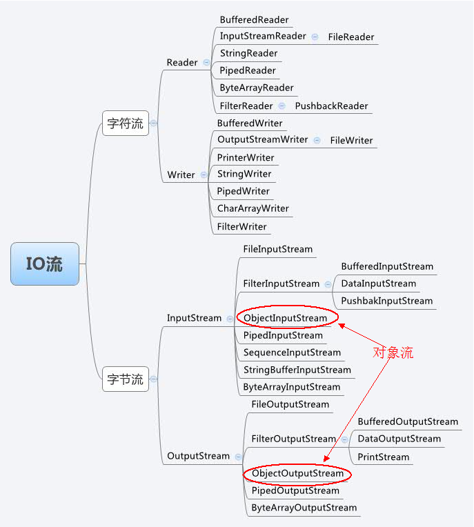

#### 序列化

+ [序列化相关](https://mp.weixin.qq.com/s/LUD1GCNDkz9yo6pTpfR9-A) | [Java 序列化、反序列化](https://mp.weixin.qq.com/s/uEBWNHiEM0iP30MekoVjtw) | [序列化 & 反序列化（对象流）](https://www.cnblogs.com/ysocean/p/6870069.html)

##### 初识

+ 概念

  + 序列化：将**对象**转换为**字节序列**的过程
  + 反序列化：将**字节序列**转换为**对象**的过程

+ 作用

  + 将内存中的对象持久化（文件、数据库）

    海量数据场景中，将对象序列化暂存到磁盘，等到使用时从磁盘中读出，反序列化成对象使用，即可以长期保存数据，又可以节省内存空间。

  + 在网络中传输对象

  + 通过 RMI（远程方法调用） 传输对象

+ 优缺点

  + 优点：
  + 缺点：

##### 实现

+ **实现 Serializable 接口**

  + Serializable 接口仅仅作为标志作用，可通过 instanceOf 关键字判断当前对象对象一定是 Serializable 接口的实例。
  + 序列化、反序列化时若类没有实现 Serializable 接口，则抛出异常 NotSerializableException

+ **设置 serialVersionUID 静态常量**

  ```java
  private static final long serialVersionUID = xxx;
  ```

  + serialVersionUID 用于标志类的版本，若不设置，则 JVM 会根据类信息计算而成。

    计算默认的 serialVersionUID 对类的详细信息高度敏感，不同的编译器计算实现千差万别，不同类定义的计算结果也是千差万别。

  + 序列化对象时，会携带 serialVersionUID。

    反序列化时，只有字节序列的 serialVersionUID 与类的 serialVersionUID 相同才能成功反序列化，否则抛出异常 InvalidClassException。

  + **不设置 serialVersionUID**（或被修改），**是线上序列化异常的常见原因**。例如：

    + 将类的实例序列化并持久化后，当业务变更，需要修改类定义，重新加载生成的 serialVersionUID 改变。
    + 分布式、微服务系统中，*相同的类往往会在不同的服务中重复定义*，当业务变更，类定义需要变更。若*各个服务中的类定义没有同步变更*，此时反序列化将引发线上异常。**（实现认知）**

  + 如何设置 serialVersionUID

    + 直接设置成 **1L**。
    + 写代码时，通过 IDE的插件 生成。

  + serialVersionUID 私有化，因为该常量仅仅用于声明类版本，若作为继承成员，则没有用处。

+ **Java 序列化**：Java 中使用 对象流 完成序列化和反序列化。

  + **ObjectOutputStream** 的 **writeObject()** 方法实现序列化
  + **ObjectInputStream** 的 **readObject()** 方法实现反序列化

  

##### 注意

+ transient 关键字

  类中不需要序列化的字段可使用 transient 关键字标志。

+ static 静态变量

  序列化只会将成员变量序列化，静态变量不会序列化。

  反序列化时，会根据方法区中静态属性的信息为其赋值。

+ 数组类

  数组类不能声明一个明确的 serialVersionUID，因此它们总是具有默认的计算值。并且，数组类没有匹配 serialVersionUID 值的要求。

+ **实习问题**

##### 实践

##### 技术选型

+ JSON 和 protoBuf 比较 

##### 其他

+ 二进制序列号怎么序列化的

##### 应用

+ [Dubbo 序列化协议](https://mp.weixin.qq.com/s/kID3Rmv1EYHsEwH-4XwGLw)


