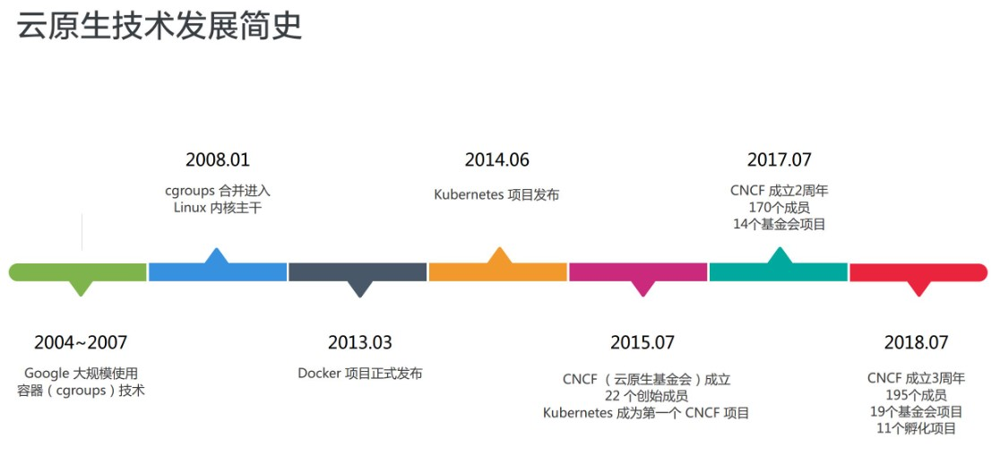
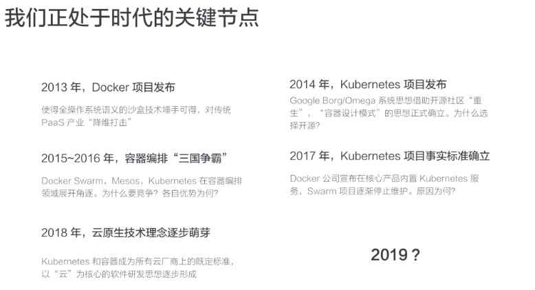
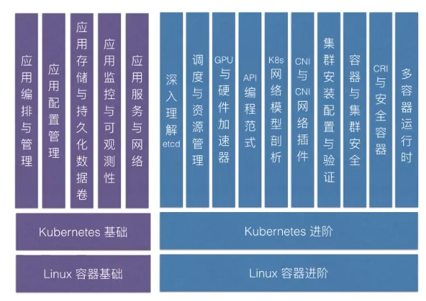
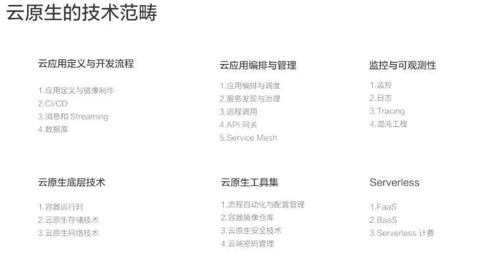

+ Kubernetes：方便、快速、优雅的管理海量的 docker 容器

  

  

+ 课程大纲

  

+ [docker 基础使用经验](https://docs.docker.com/get-started/part2/)

+ 云原生定义：

  + 云原生定义了一条云时代应用从开发到交付的最佳路径。

    ```txt
    云原生是一条使用户能 低心智负担的、敏捷的、以可扩展的、可复制的方式，最大化的利用“云”的能力、发挥“云”的价值的最佳路径。
    ```

  + 云原生其实是一套指导开发者对软件进行架构和设计的思想，按照这样的思想做出的软件，具有如下特点：

    1. 软件天然的生在云上，长在云上。
    2. 最大化的发挥云的能力，能够让软件和云集成在一起，发挥出云的最大价值
    3. 遵循全新的软件开发、发布和运维模式。

+ 为何容器技术能够对云计算产生重大影响的根本原因？为何容器技术是云原生技术的核心底盘？

  **容器技术使得应用能够有一个完整的自包含的定义方式。因此能够敏捷的，可扩展、可复制的发布在云上。**

+ 云原生技术范畴

  

  + Serverless：是 Paas 的极端形态，定义了更极端的应用编写方式，因此包括了 Faas、Baas 等对外暴露服务的方式。而无论是 Faas、Baas，都有一个核心的特点：*按使用次数计费*。

+ 云原生技术本质都一致，源于两个理论基础：

  1. 不可变基础设施：当前通过**容器镜像**的方式实现。

     ```txt
     即：运行应用的基础设施是不可变的，是完全自包含自描述，可随时迁移的。
     ```

  2. 云应用编排理论：当前通过**容器设计模式**的方式实现。（Kurbernetes 主要内容）

+ 基础设施演进：

  + 传统基础设施：可修改，基础设施独一无二！

    ```txt
    例如传统部署软件流程：
    1. SSH 连接到服务器
    2. 手动升级或降级软件包，逐个服务器地调整配置文件
    3. 将新代码部署到现有服务器上
    
    上述：基础设施服务器会被不断的调整改变
    ```

  + 对“云”友好的应用基础设施：不可修改，基础设施可随时被替代！

    ```txt
    例如：
    部署完成之后，基础设施不会被修改。如需更新，则先更改的公共镜像，利用公共镜像构建新服务，最后替换旧服务。
    经过验证后，新服务投入使用，旧服务则退役。
    ```

+ 基础设施演进的意义：

  1. 使得基础设施具备一致性和可靠性：

     ```txt
     同一个镜像在任何地方打开都是一致的，因此对于应用而言，不必关心容器在何处运行
     ```

  2. 容器镜像是自包含、可漂移的。

     ```txt
     它包含了应用运行所需要的所有依赖，因此可以漂移到云上的任意位置。
     ```

  3. 简单可预测的部署和运维能力

     ```txt
     镜像中的应用是自描述的，镜像启动后的容器可以通过 kubernetes 的 operator 技术将镜像设计成自运维的，使得流程自动化更加容易，应用本身更容易水平扩展（将应用扩展到100个10000个）。
     最后可以通过不可变的基础设施，快速复制周边的管控系统和支撑组件！
     ```

+ 实现、落地云原生这套体系所必须的四个关键技术点：

  1. 构建 **自包含、可定制的应用镜像**
  2. 实现 **应用快速部署与隔离能力**
  3. 做到 **应用基础设施创建和销毁的自动化管理**
  4. 提供 **可复制的管控系统和支撑组件**

  上述四个关键技术点，正与课程大纲对应：

  

